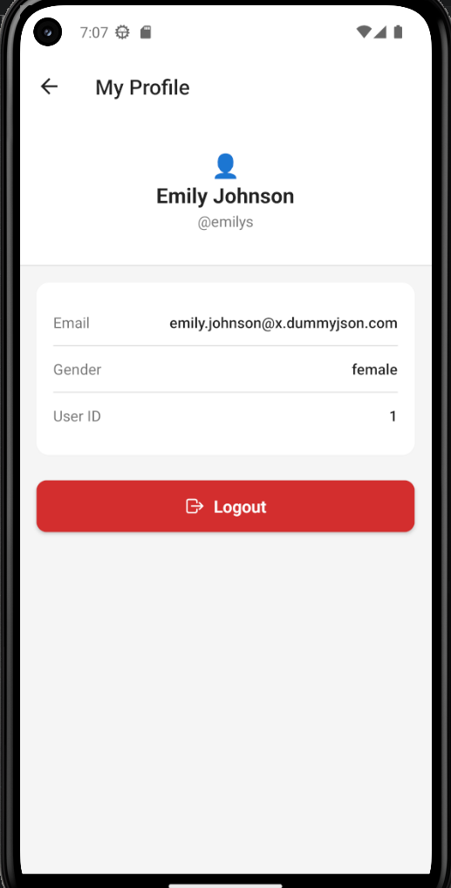
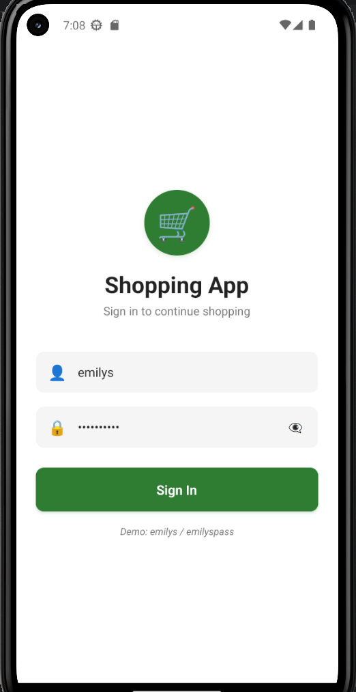
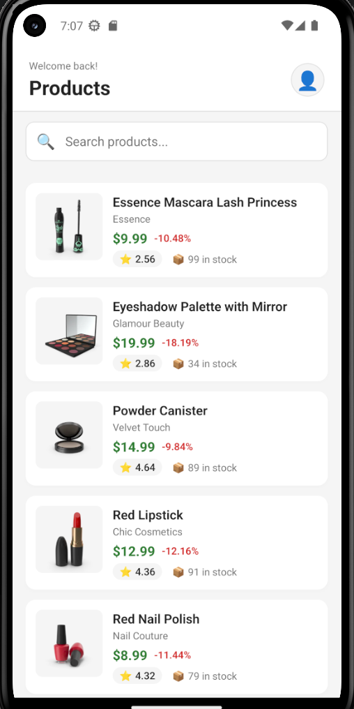
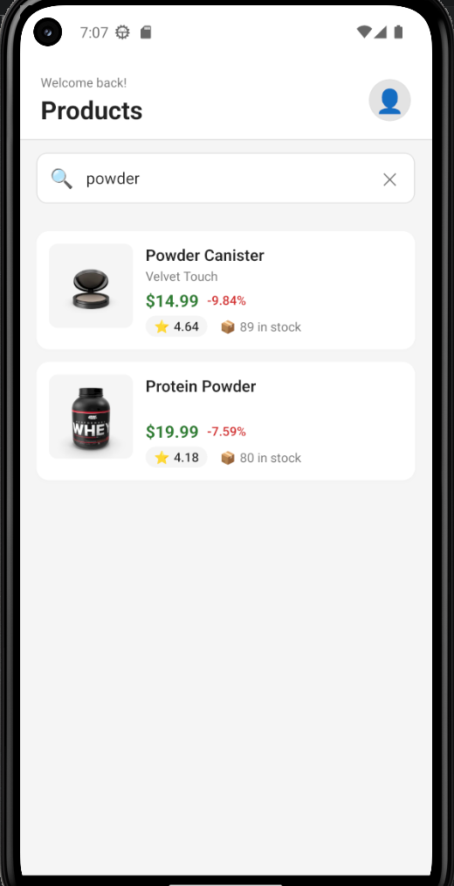
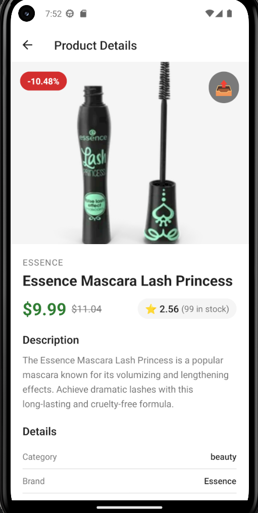
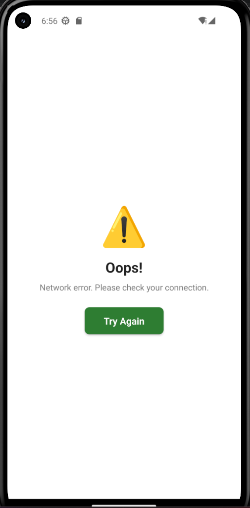

<div align="center">

# 🛍️ Shopping App

A modern shopping application built with **React Native CLI** that demonstrates authentication, REST API integration, product browsing, search functionality, session management, and clean project architecture.



<br/>


</div>

---

# 📖 Overview

Shopping App is a simple React Native application developed using **React Native CLI**.

The project demonstrates a complete mobile application flow including:

- Authentication
- Product Listing
- Product Details
- Search
- Session Persistence
- Pull to Refresh
- Error Handling
- REST API Integration

The application follows a modular folder structure with reusable components to keep the code clean, scalable, and easy to maintain.

---

# ✨ Features

- 🔐 User Login
- 🚪 Logout
- 💾 Session Persistence using AsyncStorage
- 📦 Product Listing
- 📄 Product Detail Screen
- 🔍 Search Products
- 🔄 Pull To Refresh
- ⏳ Loading Indicator
- ❌ Error Handling with Retry
- 📱 Responsive User Interface
- 🧩 Reusable Components
- 🌐 REST API Integration
- 🧭 React Navigation

---

# 📱 Application Screens

## 🔐 Login Screen



---

## 🏠 Home Screen



---

## 🔍 Search Products



---

## 📄 Product Details



---

## ❌ Error Handling



---

# 🏗️ Project Structure

```text
Shopping_App
│
├── android
├── ios
├── images
│
├── src
│   ├── components
│   │   ├── common
│   │   │   ├── Loader.js
│   │   │   ├── ErrorView.js
│   │   │   └── EmptyState.js
│   │   │
│   │   ├── ProductCard.js
│   │   └── SearchBar.js
│   │
│   ├── contexts
│   │   └── AuthContext.js
│   │
│   ├── hooks
│   │   ├── useAuth.js
│   │   └── useProducts.js
│   │
│   ├── navigation
│   │   └── AppNavigator.js
│   │
│   ├── screens
│   │   ├── LoginScreen.js
│   │   ├── HomeScreen.js
│   │   ├── DetailScreen.js
│   │   └── ProfileScreen.js
│   │
│   ├── services
│   │   ├── api.js
│   │   ├── authService.js
│   │   └── productService.js
│   │
│   └── theme
│       └── colors.js
│
├── App.js
├── package.json
└── README.md
```

---

# ⚙️ Tech Stack

| Technology | Purpose |
|------------|---------|
| React Native CLI | Mobile App Development |
| JavaScript (ES6+) | Programming Language |
| React Navigation | Screen Navigation |
| Axios | API Requests |
| AsyncStorage | Session Management |
| DummyJSON API | Products API |
| ReqRes API | Authentication |

---

# 🌐 APIs Used

## Authentication

```
POST https://reqres.in/api/login
```

## Products List

```
GET https://dummyjson.com/products
```

## Product Details

```
GET https://dummyjson.com/products/{id}
```

---

# 🚀 Getting Started

## Clone Repository

```bash
git clone https://github.com/AbhishekVerma3208/Shopping_App.git
```

## Navigate to Project

```bash
cd Shopping_App
```

## Install Dependencies

```bash
npm install
```

## Start Metro

```bash
npx react-native start
```

## Run Android

```bash
npx react-native run-android
```

---

# 🔑 Demo Login Credentials

**Email**

```
eve.holt@reqres.in
```

**Password**

```
cityslicka
```

---

# 📦 Download APK

You can download and test the application from the link below:

👉 **Google Drive**

https://drive.google.com/file/d/15pwWr314ySigliMHFppxebRpIEFAgae4/view?usp=sharing

---

# ✅ Implemented Features

- Authentication
- Login
- Logout
- Session Persistence
- Product Listing
- Product Details
- Search Functionality
- Pull To Refresh
- Loading State
- Error Handling
- REST API Integration
- React Navigation
- Reusable Components

---

# 🔮 Future Enhancements

- 🛒 Add to Cart
- ❤️ Wishlist
- 📂 Product Categories
- 🌙 Dark Mode
- 📑 Pagination
- ⭐ Product Reviews
- 👤 User Profile
- 🔔 Push Notifications

---

# 👨‍💻 Developer

### Abhishek Verma

**GitHub**

https://github.com/AbhishekVerma3208

**LinkedIn**

https://www.linkedin.com/in/abhishekverma3208/

---

<div align="center">

### ⭐ Thank you for checking out this project!

If you found it useful, feel free to give the repository a ⭐.

Made with ❤️ using React Native CLI

</div>
